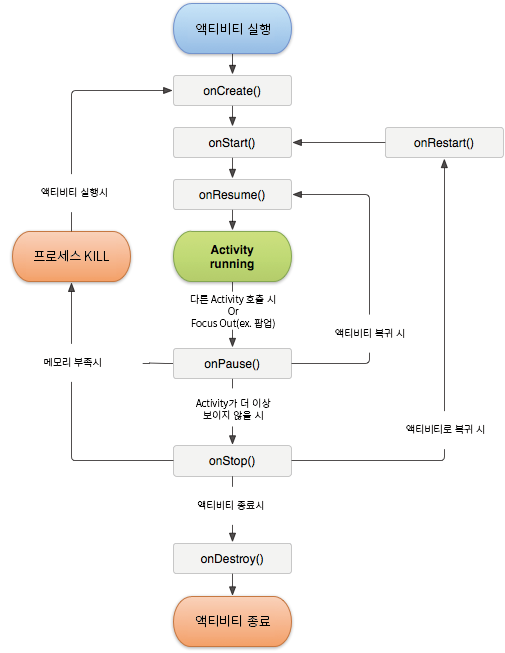

# AndroidLifeCycle
### Task
액티비티의 생명주기를 알기전에 Task라는 것에 알아야 하는데 Task라고 하는 것은 사용자와 상호작용하여 특정작업을 실행하는  
Activity의 집합이다.  
Task는 스택의 형식을 띄는데 먼저 생성된 Activity의 순서대로 스택에 저장되게 된다.  
  
### 7가지 중요 State  
+ onCreate
+ onStart
+ onResume
+ onPause
+ onStop
+ onRestart
+ onDestroy  
***
  
### LifeCycle

